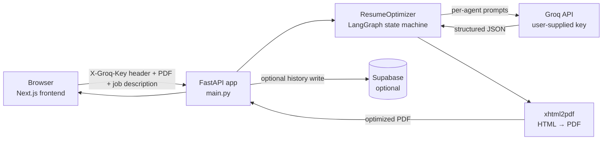
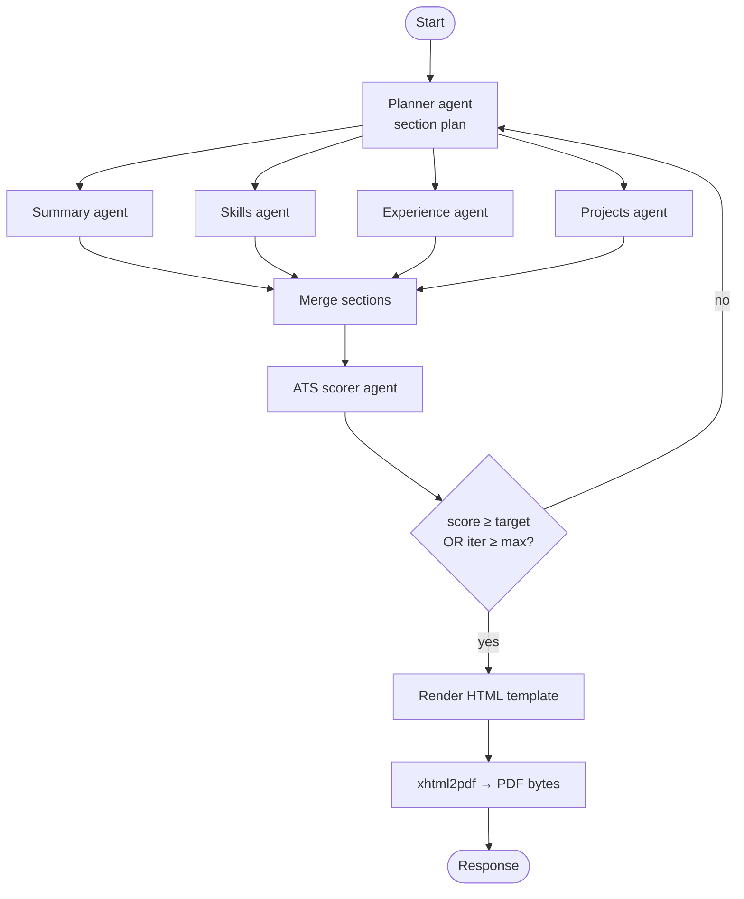

# Vanara.ai Backend: Architecture

This document describes how requests flow through the backend and how the 5-agent
optimization pipeline is structured. It complements `README.md` (which focuses
on setup and deployment).

## High-level flow

## Request lifecycle: `/optimize_resume/`

1. **Client** sends `multipart/form-data` POST with the resume PDF, job
   description, and headers: `X-Groq-Key`, optionally `X-User-*`.
2. **`deps.py`** extracts the Groq key and user identity headers via FastAPI
   dependencies. The key is never written to a file or database.
3. **`resume_parser.py`** extracts text from the PDF (PyMuPDF / PyPDF2) and
   chunks it into logical sections.
4. **`resume_optimizer.py`** runs a LangGraph state machine:

5. **`pdf_utils.py`** renders the Jinja2 template (`resume_template_7.html`
   or `resume_template_10.html`), sanitizes Unicode, and hands the HTML to
   `xhtml2pdf.pisa.CreatePDF` with `base_path` pointing to the template
   directory so fonts resolve.
6. **`main.py`** returns the score breakdown + a downloadable URL. If
   Supabase is configured, `database.py` writes a history row.

## Key design decisions

### BYOK (Bring Your Own Key)
- The Groq key never touches the backend filesystem, logs, or database.
- `deps.py::get_groq_key` reads `X-Groq-Key` per request and passes it to
  `ChatOpenAI(base_url="https://api.groq.com/openai/v1", api_key=...)`.
- `logging_utils.py` uses an **allow-list** redactor: only whitelisted fields
  are logged; everything else is replaced with `<redacted>`.

### Optional Supabase
- The whole app runs **stateless** when `SUPABASE_URL` / `SUPABASE_KEY`
  are unset. `/optimize_resume/` returns the PDF bytes directly.
- When configured, the same endpoints transparently persist history,
  parsed resumes, and feedback. The client detects the mode via the
  `supabaseEnabled` flag.

### Rate limiting
- Not enforced at the backend level; we expect self-hosted deployments to
  front-end with nginx / Cloudflare / Render's built-in limits. See H1 in
  the audit report for public-deploy guidance (`slowapi`).

### PDF pipeline
- **xhtml2pdf** (pure Python, no native deps) over WeasyPrint (needs
  Cairo/Pango). This makes the Dockerfile tiny and CI fast.
- Unicode sanitizer in `pdf_utils.py::sanitize_for_pdf` maps characters
  the packaged fonts don't have (e.g. U+2011, U+2014, arrows, smart quotes)
  to ASCII equivalents before the HTML → PDF conversion.

## Module map

| Module | Role |
|--------|------|
| `main.py` | FastAPI app, all HTTP routes, CORS, startup |
| `deps.py` | FastAPI `Depends()` for BYOK key + user headers |
| `env.py` | Loads `.env` for local dev |
| `logger.py` | Logging configuration |
| `logging_utils.py` | Allow-list redactor |
| `models.py` | Pydantic models (resume, sections, scoring) |
| `resume_parser.py` | PDF → structured resume JSON |
| `resume_optimizer.py` | 5-agent LangGraph pipeline |
| `optimized_pipeline.py` | Single-call optimized flow (fewer tokens) |
| `cloud_taxonomy.py` | AWS / GCP / Azure service vocabulary for ATS matching |
| `pdf_utils.py` | HTML rendering + `xhtml2pdf` glue |
| `database.py` | Supabase persistence (optional) |
| `email_service.py` | Feedback email delivery (optional) |
| `constants.py` | Template paths |

## See also

- `README.md`: quickstart, environment variables, deployment
- `CONTRIBUTING.md`: development workflow
- `SECURITY.md`: vulnerability reporting
- FastAPI auto-generated API docs at `/docs` when the server is running
